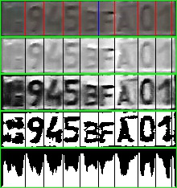
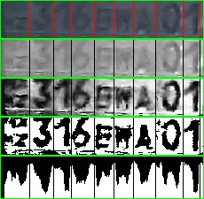
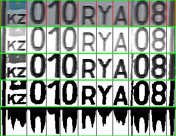

## Kazakh license plate preproicessing and segmentation

Short Algo:

1. Histogram equalization
2. Binarization
3. Histohram segmentation

Repo consist experiment with several binarisers. Such as Niblack, Otsu etc.

## Result samples

